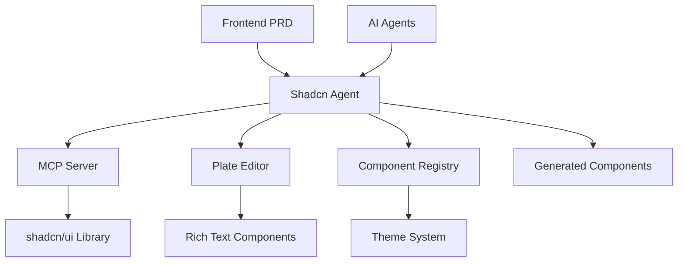

# Shadcn Agent - Design Implementation Guide

*Practical implementation guide derived from the comprehensive Shadcn/UI Specialized Agent PRD*

## 1. System Architecture Overview

### Integration Points


### Component Flow
```typescript
interface ShadcnAgentFlow {
  input: {
    source: 'PRD requirements' | 'AI agent request' | 'developer command';
    requirements: ComponentRequirements;
    context: ProjectContext;
  };
  
  processing: {
    analysis: 'Requirement analysis and component mapping';
    selection: 'Optimal component selection from registry';
    customization: 'Theme and accessibility application';
    integration: 'Plate editor integration if needed';
  };
  
  output: {
    components: 'Generated and customized components';
    documentation: 'Component usage documentation';
    tests: 'Accessibility and interaction tests';
    updates: 'Design system documentation updates';
  };
}
```

## 2. MCP Server Integration Architecture

### Core MCP Implementation
```typescript
interface MCPServerIntegration {
  primaryServer: {
    name: '@jpisnice/shadcn-ui-mcp-server';
    capabilities: [
      'component_source_retrieval',
      'demo_code_access',
      'installation_guide_generation',
      'multi_framework_support'
    ];
    configuration: {
      frameworks: ['react', 'svelte', 'vue'];
      apiKey: 'GITHUB_TOKEN for 5000 requests/hour';
      caching: 'enabled for performance optimization';
    };
  };
  
  plateIntegration: {
    server: 'plate-shadcn-bridge';
    components: [
      'RichTextEditor',
      'MarkdownEditor',
      'CommentEditor',
      'BlogEditor'
    ];
    plugins: [
      'tables', 'mentions', 'markdown',
      'links', 'images', 'code-blocks'
    ];
  };
  
  customRegistry: {
    location: './shadcn-registry.json';
    components: 'Project-specific component definitions';
    themes: 'Custom theme configurations';
    overrides: 'Component customization overrides';
  };
}
```

### MCP Server Configuration
```json
{
  "mcpServers": {
    "shadcn-ui-server": {
      "command": "npx",
      "args": [
        "@jpisnice/shadcn-ui-mcp-server",
        "--framework", "react",
        "--github-api-key", "${GITHUB_TOKEN}"
      ],
      "env": {
        "GITHUB_TOKEN": "your_github_token_here"
      }
    },
    "plate-integration": {
      "command": "node",
      "args": ["./scripts/plate-mcp-server.js"],
      "env": {
        "NODE_ENV": "development"
      }
    }
  }
}
```

## 3. Component Generation Workflow

### Automated Component Scaffolding
```typescript
interface ComponentScaffolding {
  triggers: {
    prdAnalysis: {
      process: 'Analyze Frontend PRD for UI requirements';
      extraction: 'Extract component needs from requirements';
      mapping: 'Map requirements to shadcn components';
      customization: 'Apply project-specific customizations';
    };
    
    aiRequest: {
      input: 'Natural language component request';
      parsing: 'Parse intent and component requirements';
      validation: 'Validate against design system guidelines';
      generation: 'Generate appropriate component code';
    };
    
    developerCommand: {
      cli: 'Direct CLI command for component addition';
      configuration: 'Use predefined component configurations';
      installation: 'Automatic installation and setup';
      documentation: 'Generate usage documentation';
    };
  };
  
  componentTypes: {
    forms: {
      components: ['LoginForm', 'RegistrationForm', 'ContactForm', 'SettingsForm'];
      features: ['validation', 'accessibility', 'error handling', 'submission'];
      integration: 'React Hook Form + Zod validation';
    };
    
    dataDisplay: {
      components: ['DataTable', 'Dashboard', 'Charts', 'StatsCards'];
      features: ['sorting', 'filtering', 'pagination', 'responsive'];
      integration: 'TanStack Table + Chart.js';
    };
    
    navigation: {
      components: ['Navbar', 'Sidebar', 'Breadcrumbs', 'Tabs'];
      features: ['responsive', 'keyboard navigation', 'active states'];
      integration: 'React Router + accessibility';
    };
    
    feedback: {
      components: ['Toast', 'Modal', 'AlertDialog', 'Progress'];
      features: ['animations', 'accessibility', 'auto-dismiss'];
      integration: 'Radix UI primitives';
    };
  };
}
```

### Component Customization Pipeline
```typescript
interface CustomizationPipeline {
  theming: {
    colorSystem: {
      primary: 'Brand primary color application';
      semantic: 'Success, error, warning, info colors';
      neutral: 'Gray scale and background colors';
      accessibility: 'Contrast ratio validation and adjustment';
    };
    
    typography: {
      scale: 'Type scale application (heading, body, caption)';
      families: 'Font family application and loading';
      weights: 'Font weight system implementation';
      lineHeight: 'Line height optimization for readability';
    };
    
    spacing: {
      scale: 'Spacing scale application (4px base grid)';
      responsive: 'Responsive spacing adjustments';
      component: 'Component-specific spacing rules';
      layout: 'Layout spacing and grid systems';
    };
  };
  
  accessibility: {
    aria: {
      labels: 'ARIA label generation and application';
      roles: 'Semantic role assignment';
      states: 'Dynamic state communication';
      descriptions: 'Detailed descriptions for complex components';
    };
    
    keyboard: {
      navigation: 'Tab order and focus management';
      shortcuts: 'Keyboard shortcut implementation';
      trapping: 'Focus trapping for modals and overlays';
      indicators: 'Visible focus indicators';
    };
    
    visual: {
      contrast: 'Color contrast validation and adjustment';
      sizing: 'Minimum touch target sizing (44px)';
      motion: 'Respect for prefers-reduced-motion';
      text: 'Text scaling and readability';
    };
  };
  
  responsive: {
    breakpoints: {
      mobile: '375px - 639px (touch-first design)';
      tablet: '640px - 1023px (hybrid interaction)';
      desktop: '1024px - 1439px (mouse and keyboard)';
      wide: '1440px+ (large display optimization)';
    };
    
    components: {
      layout: 'Component layout adaptation per breakpoint';
      navigation: 'Navigation pattern changes (hamburger, sidebar)';
      content: 'Content density and presentation changes';
      interactions: 'Touch vs. mouse interaction optimization';
    };
  };
}
```

## 4. Plate Editor Integration

### Rich Text Editor Implementation
```typescript
interface PlateEditorIntegration {
  editorTypes: {
    blogEditor: {
      plugins: ['headings', 'paragraphs', 'lists', 'links', 'images', 'blockquotes'];
      toolbar: 'Full-featured formatting toolbar';
      features: ['markdown shortcuts', 'slash commands', 'drag & drop'];
      usage: 'Blog post creation and content management';
    };
    
    commentEditor: {
      plugins: ['paragraphs', 'mentions', 'links', 'emoji'];
      toolbar: 'Minimal toolbar with essential formatting';
      features: ['@mentions', 'emoji picker', 'auto-save'];
      usage: 'Comments, reviews, and collaborative feedback';
    };
    
    noteEditor: {
      plugins: ['headings', 'lists', 'tables', 'code', 'math'];
      toolbar: 'Structured content toolbar';
      features: ['table editing', 'code syntax highlighting', 'math formulas'];
      usage: 'Documentation, notes, and structured content';
    };
    
    chatEditor: {
      plugins: ['paragraphs', 'mentions', 'links', 'files'];
      toolbar: 'Hidden toolbar with keyboard shortcuts';
      features: ['file attachments', 'message threading', 'real-time collaboration'];
      usage: 'Real-time messaging and chat interfaces';
    };
  };
  
  componentIntegration: {
    wrapper: {
      component: '<RichTextEditor />';
      props: 'Configurable plugins, toolbar, and styling';
      styling: 'Seamless integration with shadcn theme system';
      accessibility: 'Full keyboard navigation and screen reader support';
    };
    
    plugins: {
      aiAssistance: 'AI-powered content suggestions and improvements';
      collaboration: 'Real-time collaborative editing capabilities';
      version: 'Version history and change tracking';
      export: 'Export to multiple formats (HTML, Markdown, PDF)';
    };
  };
  
  shadcnIntegration: {
    toolbar: 'Use shadcn Button and Toggle components for toolbar';
    dialogs: 'shadcn Dialog components for link and image insertion';
    menus: 'shadcn DropdownMenu for formatting options';
    forms: 'shadcn Form components for editor configuration';
  };
}
```

### Editor Configuration Examples
```tsx
// Blog Editor Configuration
const BlogEditorConfig = {
  plugins: [
    createParagraphPlugin(),
    createHeadingPlugin(),
    createListPlugin(),
    createLinkPlugin(),
    createImagePlugin(),
    createBlockquotePlugin(),
    createCodeBlockPlugin(),
    createMarkdownPlugin(),
    createSlashCommandPlugin(),
  ],
  components: {
    [ParagraphPlugin.key]: ParagraphElement,
    [HeadingPlugin.key]: HeadingElement,
    [LinkPlugin.key]: LinkElement,
    [ImagePlugin.key]: ImageElement,
  },
  override: {
    components: withShadcnComponents,
  },
};

// Comment Editor Configuration
const CommentEditorConfig = {
  plugins: [
    createParagraphPlugin(),
    createMentionPlugin(),
    createLinkPlugin(),
    createEmojiPlugin(),
    createAutoSavePlugin(),
  ],
  components: {
    [ParagraphPlugin.key]: ParagraphElement,
    [MentionPlugin.key]: MentionElement,
    [LinkPlugin.key]: LinkElement,
  },
  override: {
    components: withShadcnComponents,
  },
};
```

## 5. AI Agent Integration

### Claude Code Integration
```typescript
interface ClaudeCodeIntegration {
  commandPatterns: {
    componentGeneration: {
      trigger: '"Generate a {component_type} using shadcn"';
      processing: 'Analyze requirements and select appropriate components';
      customization: 'Apply project theme and accessibility requirements';
      output: 'Complete component with tests and documentation';
    };
    
    formGeneration: {
      trigger: '"Create a {form_type} form with validation"';
      processing: 'Generate form schema and validation rules';
      integration: 'React Hook Form + Zod + shadcn components';
      output: 'Type-safe form with error handling and accessibility';
    };
    
    layoutCreation: {
      trigger: '"Build a {layout_type} layout"';
      processing: 'Analyze layout requirements and responsive needs';
      components: 'Combine multiple shadcn components for layout';
      output: 'Responsive layout with proper semantic structure';
    };
  };
  
  promptTemplates: {
    componentRequest: `
      Generate a {component_name} component using shadcn/ui that:
      - Follows our design system guidelines
      - Implements WCAG 2.1 AA accessibility standards
      - Includes proper TypeScript types
      - Has responsive design for mobile, tablet, and desktop
      - Includes interaction tests with Testing Library
    `;
    
    formRequest: `
      Create a {form_type} form that:
      - Uses React Hook Form for state management
      - Implements Zod schema validation
      - Uses shadcn Form, Input, and Button components
      - Includes proper error handling and display
      - Has accessible labels and descriptions
      - Supports both light and dark themes
    `;
    
    integrationRequest: `
      Integrate Plate editor into a shadcn component that:
      - Uses the {editor_type} configuration
      - Applies our theme system consistently
      - Includes proper toolbar styling with shadcn components
      - Has accessibility features enabled
      - Supports real-time collaboration if needed
    `;
  };
}
```

### Cursor AI Integration
```typescript
interface CursorAIIntegration {
  workspaceConfiguration: {
    rules: [
      'Always use shadcn/ui components instead of building custom ones',
      'Apply project theme tokens from tailwind.config.ts',
      'Include accessibility attributes in all interactive elements',
      'Use TypeScript with strict mode for all component props',
      'Follow the established component naming conventions',
      'Include interaction tests for user-facing components'
    ];
    
    codeGeneration: {
      templates: 'Pre-defined component templates with best practices';
      snippets: 'Code snippets for common shadcn patterns';
      refactoring: 'Automated refactoring to use shadcn components';
      optimization: 'Performance optimization suggestions';
    };
  };
  
  contextAwareness: {
    projectStructure: 'Understanding of component organization';
    designSystem: 'Awareness of theme tokens and design patterns';
    accessibility: 'Knowledge of WCAG requirements and implementation';
    performance: 'Understanding of performance implications';
  };
}
```

## 6. Governance and Maintenance

### Component Registry Management
```typescript
interface ComponentGovernance {
  registry: {
    structure: {
      approved: 'List of approved shadcn components for the project';
      customizations: 'Project-specific component customizations';
      versions: 'Version tracking for component updates';
      deprecations: 'Deprecated components and migration paths';
    };
    
    validation: {
      accessibility: 'Automated accessibility testing for all components';
      performance: 'Performance benchmarks and regression testing';
      design: 'Design system compliance validation';
      code: 'Code quality and TypeScript compliance checks';
    };
  };
  
  updateWorkflow: {
    shadcnUpdates: {
      monitoring: 'Monitor shadcn/ui releases for updates';
      testing: 'Test updates in isolated environment';
      migration: 'Provide migration guides for breaking changes';
      rollout: 'Gradual rollout with rollback capabilities';
    };
    
    plateUpdates: {
      monitoring: 'Monitor Plate editor releases';
      compatibility: 'Test compatibility with shadcn integration';
      features: 'Evaluate new features for project integration';
      documentation: 'Update documentation and examples';
    };
  };
  
  qualityAssurance: {
    automated: {
      accessibility: 'Automated a11y testing with axe-core';
      visual: 'Visual regression testing with Playwright';
      performance: 'Performance testing and monitoring';
      integration: 'Component integration testing';
    };
    
    manual: {
      designReview: 'Design team review for new components';
      usabilityTesting: 'User testing for complex components';
      codeReview: 'Peer review for custom implementations';
      documentation: 'Documentation review and updates';
    };
  };
}
```

### Success Metrics and Monitoring
```typescript
interface SuccessMetrics {
  development: {
    velocity: {
      metric: 'Component implementation speed with shadcn';
      target: '60% faster than custom component development';
      measurement: 'Time tracking from requirement to implementation';
    };
    
    consistency: {
      metric: 'Design system adherence across components';
      target: '95% design system compliance';
      measurement: 'Automated design token usage analysis';
    };
    
    reusability: {
      metric: 'Component reuse rate across features';
      target: '80% of UI elements use existing components';
      measurement: 'Component usage analytics and tracking';
    };
  };
  
  quality: {
    accessibility: {
      metric: 'WCAG 2.1 AA compliance rate';
      target: '100% compliance for all components';
      measurement: 'Automated and manual accessibility testing';
    };
    
    performance: {
      metric: 'Bundle size impact of shadcn components';
      target: 'Maintain optimal bundle size with tree shaking';
      measurement: 'Bundle analysis and performance monitoring';
    };
    
    maintenance: {
      metric: 'Component maintenance effort reduction';
      target: '50% reduction in component-related issues';
      measurement: 'Issue tracking and resolution time analysis';
    };
  };
  
  userExperience: {
    adoption: {
      metric: 'Developer adoption rate of shadcn workflow';
      target: '90% of team using shadcn-first approach';
      measurement: 'Developer survey and usage analytics';
    };
    
    satisfaction: {
      metric: 'Developer satisfaction with component development';
      target: '4.5/5 satisfaction score';
      measurement: 'Regular developer experience surveys';
    };
  };
}
```

---

## Repository Placement

**File Location**: `design/shadcn-design.md`

This design document should be placed in the `design/` directory of your repository structure, complementing the comprehensive Shadcn/UI Specialized Agent PRD while providing practical implementation guidance for development teams.