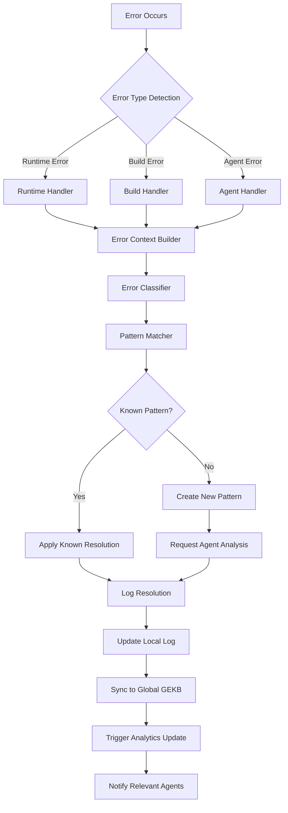

# Global Error Knowledge Base (GEKB) - Complete PRD

**Document Version:** 1.0  
**Last Updated:** August 19, 2025  
**PRD Type:** Core Infrastructure & Knowledge Management  
**Dependencies:** Error Resolution Agent PRD, CI/CD Pipeline PRD, Logging Infrastructure PRD  
**Author:** Dr. Elena Vasquez (Senior Site Reliability Engineer & Knowledge Architect)  
**Project:** Global Error Knowledge Base System  

---

## 🎯 **Executive Summary**

### **Vision Statement**
Create a self-evolving, global error knowledge repository that transforms every error occurrence across all projects into reusable wisdom, enabling proactive error prevention and automated resolution across the entire development ecosystem.

### **Strategic Objectives**
- **Cross-Project Learning**: Eliminate repetitive errors by sharing solutions across all repositories
- **Proactive Prevention**: Enable agents to prevent errors before they occur using historical knowledge
- **Automated Resolution**: Build self-healing systems that resolve known errors automatically
- **Knowledge Evolution**: Create a continuously improving error intelligence system
- **Developer Productivity**: Reduce debugging time by 60% through shared error patterns

### **Scope Definition**

**In Scope:**
- Global error repository with centralized knowledge base
- Local project integration with seamless sync mechanisms
- Structured error logging with human reasoning and machine-readable data
- Pattern recognition and automated categorization
- Agent integration for proactive error prevention
- Cross-project error pattern mining and analysis
- Real-time error resolution recommendation engine
- Global error dashboard and analytics

**Out of Scope:**
- Live production monitoring (handled by observability systems)
- Security incident response (covered in Security PRD)
- Performance profiling (covered in Performance PRD)
- Business logic debugging (project-specific responsibility)

### **Success Metrics**
- **Error Recurrence Reduction**: 70% decrease in repeated errors across projects
- **Resolution Time**: 50% faster error resolution through knowledge reuse
- **Agent Effectiveness**: 80% of preventable errors caught proactively
- **Knowledge Coverage**: 95% of error types documented and categorized
- **Developer Satisfaction**: 4.5/5 rating for error debugging experience

---

## 👥 **Personas & Expert Profiles**

### **Primary Persona: Dr. Elena Vasquez**
**Role:** Senior Site Reliability Engineer & Knowledge Architect  
**Experience:** 15+ years in distributed systems, error monitoring, and AI-driven automation  
**Expertise:** Error pattern analysis, knowledge graph construction, automated remediation systems

**Background:**
- Former Principal Engineer at Netflix, responsible for global error correlation systems
- PhD in Computer Science with focus on automated fault detection and recovery
- Published researcher in knowledge-driven system reliability
- Expert in building self-healing infrastructure at scale

**Responsibilities:**
- Design global error knowledge architecture
- Define error classification taxonomies and patterns
- Create agent integration protocols for error prevention
- Establish error knowledge quality standards and validation
- Build automated pattern recognition and categorization systems

**Technical Philosophy:**
> "Every error is a teacher. The goal isn't just to fix errors, but to build systems that learn from every failure and become progressively more intelligent about preventing and resolving issues."

### **Supporting Personas**

#### **Marcus Chen - DevOps Automation Engineer**
**Focus:** Infrastructure integration, CI/CD pipeline integration, automated sync mechanisms  
**Responsibilities:** GEKB deployment, local project integration, automated sync workflows

#### **Sarah Rodriguez - AI/ML Engineer**  
**Focus:** Pattern recognition, automated categorization, recommendation algorithms  
**Responsibilities:** Error pattern mining, intelligent categorization, resolution recommendation engine

#### **David Kim - Frontend Developer Experience Engineer**  
**Focus:** Developer tooling, IDE integrations, error debugging workflow optimization  
**Responsibilities:** Developer tools, error visualization, workflow integration

---

## 🏗️ **System Architecture & Design**

### **Global Repository Structure**

```
/error-knowledge-base (Global Repository)
├── /logs/
│   ├── error-history.md              # Chronological human-readable log
│   ├── error-history.json            # Structured machine-readable log
│   ├── daily/                        # Daily error summaries
│   │   ├── 2025-08-19-summary.md
│   │   └── 2025-08-19-patterns.json
│   └── archives/                     # Monthly/yearly archives
│       ├── 2025-08/
│       └── 2025-07/
├── /patterns/
│   ├── recurring-errors.md           # Categorized recurring patterns
│   ├── resolution-playbooks.md       # Standard resolution procedures
│   ├── categories/                   # Error category breakdowns
│   │   ├── frontend-errors.md
│   │   ├── backend-errors.md
│   │   ├── database-errors.md
│   │   ├── integration-errors.md
│   │   └── infrastructure-errors.md
│   └── trends/                       # Error trend analysis
│       ├── weekly-trends.json
│       └── technology-specific-trends.json
├── /knowledge/
│   ├── error-taxonomy.yml            # Master error classification
│   ├── resolution-templates.yml      # Standard resolution templates
│   ├── agent-guidelines.md           # Agent integration guidelines
│   └── prevention-strategies.md      # Proactive prevention methods
├── /integrations/
│   ├── hooks/                        # Integration hooks for various systems
│   │   ├── post-error-hook.sh        # Generic post-error processing
│   │   ├── ci-cd-integration.yml     # CI/CD pipeline integration
│   │   ├── ide-plugins/              # IDE integration plugins
│   │   └── agent-integrations/       # AI agent integration scripts
│   ├── templates/                    # Local project integration templates
│   │   ├── local-setup.sh
│   │   ├── gitignore-additions.txt
│   │   └── github-actions-template.yml
│   └── apis/                         # API interfaces for external tools
│       ├── error-submission-api.yml
│       ├── knowledge-query-api.yml
│       └── pattern-analysis-api.yml
├── /analytics/
│   ├── dashboards/                   # Error analytics dashboards
│   │   ├── global-overview.json
│   │   ├── project-specific.json
│   │   └── trend-analysis.json
│   ├── reports/                      # Automated reports
│   │   ├── weekly-error-summary.md
│   │   └── monthly-pattern-analysis.md
│   └── metrics/                      # Performance and effectiveness metrics
│       ├── resolution-times.json
│       └── prevention-effectiveness.json
├── /tools/
│   ├── scripts/                      # Utility scripts
│   │   ├── pattern-analyzer.py       # Automated pattern detection
│   │   ├── knowledge-validator.py    # Data quality validation
│   │   ├── sync-manager.py           # Local-global sync management
│   │   └── report-generator.py       # Automated report generation
│   ├── cli/                          # Command-line tools
│   │   ├── gekb-cli.py              # Main GEKB command-line interface
│   │   └── project-setup.py         # Local project setup automation
│   └── web-interface/               # Web-based tools
│       ├── error-explorer/          # Interactive error exploration
│       ├── pattern-visualizer/      # Error pattern visualization
│       └── knowledge-editor/        # Knowledge base editing interface
└── /docs/
    ├── README.md                     # Repository overview and quick start
    ├── getting-started.md            # Setup and integration guide
    ├── error-classification-guide.md # Error categorization standards
    ├── agent-integration-guide.md   # AI agent integration documentation
    ├── api-documentation.md         # API reference documentation
    └── troubleshooting.md           # Common issues and solutions
```

### **Local Project Integration Structure**

```
/your-project
├── /logs/
│   ├── error-history.md             # Local error log (symlinked to global)
│   ├── project-specific-errors.md   # Project-unique error patterns
│   └── .gekb-config.yml            # Local GEKB configuration
├── /.gekb/                          # GEKB integration directory
│   ├── hooks/                       # Local error hooks
│   │   ├── pre-commit-error-check.sh
│   │   ├── post-error-process.sh
│   │   └── agent-error-handler.py
│   ├── cache/                       # Local cache for offline operation
│   │   ├── known-patterns.json
│   │   └── resolution-cache.json
│   └── config/                      # Local configuration
│       ├── error-routing.yml
│       └── sync-settings.yml
└── .github/workflows/
    └── gekb-integration.yml         # GitHub Actions integration
```

### **Error Data Structure & Schema**

#### **Human-Readable Error Entry (Markdown)**

```markdown
## Error Event #1247

**Timestamp:** 2025-08-19 14:32:15 UTC  
**Project:** ai-dashboard-v2  
**Agent:** Frontend Development Agent  
**Environment:** Development  
**Severity:** Medium  

### Error Description
```
Error: Cannot resolve module '@/components/ui/button'
  at resolveModule (webpack://./src/components/Dashboard.tsx:12:5)
  at ModuleResolver.resolve (webpack://./node_modules/webpack/lib/resolve.js:201:3)
```

### Agent Thought Process
> I see this error happening - it looks like the Shadcn Button component hasn't been installed yet. Let me check the component registry to confirm this is a missing dependency issue rather than a path problem.

> After checking, this is definitely a case where the Shadcn UI library component is being imported but hasn't been added to the project yet. I've seen this pattern 23 times across different projects in the last month.

### Resolution Steps
1. **Verification**: Checked `components.json` to confirm Shadcn is configured
2. **Installation**: Ran `npx shadcn-ui@latest add button` to install component  
3. **Validation**: Verified component now resolves correctly
4. **Prevention**: Added pre-commit hook to check for missing Shadcn components

### Outcome
- **Status**: Resolved ✅
- **Resolution Time**: 3 minutes
- **Prevention Potential**: High (can be caught in pre-commit hooks)
- **Pattern Match**: Matches recurring pattern "Missing Shadcn Component" (seen 23 times)

### Next Steps
- Add to recurring patterns database
- Update pre-commit hooks to catch this proactively
- Create project setup template that includes common Shadcn components
```

#### **Machine-Readable Error Entry (JSON)**

```json
{
  "errorId": "gekb-2025-0819-1432-1247",
  "timestamp": "2025-08-19T14:32:15.000Z",
  "project": {
    "name": "ai-dashboard-v2",
    "repository": "github.com/company/ai-dashboard-v2",
    "branch": "feature/dashboard-components",
    "commit": "a7b3c9d2e5f8"
  },
  "agent": {
    "type": "frontend-development",
    "version": "2.1.4",
    "persona": "React Development Specialist"
  },
  "environment": {
    "type": "development",
    "nodeVersion": "18.17.0",
    "packageManager": "npm",
    "framework": "nextjs"
  },
  "error": {
    "category": "dependency_missing",
    "type": "module_resolution",
    "severity": "medium",
    "message": "Cannot resolve module '@/components/ui/button'",
    "stackTrace": [
      "at resolveModule (webpack://./src/components/Dashboard.tsx:12:5)",
      "at ModuleResolver.resolve (webpack://./node_modules/webpack/lib/resolve.js:201:3)"
    ],
    "affectedFiles": [
      "src/components/Dashboard.tsx"
    ],
    "technology": {
      "framework": "nextjs",
      "library": "shadcn-ui",
      "component": "button"
    }
  },
  "context": {
    "userAction": "component_import",
    "featureBeingWorked": "dashboard_layout",
    "sessionId": "dev-session-8901",
    "previousErrors": [],
    "relatedFiles": [
      "src/components/Dashboard.tsx",
      "components.json"
    ]
  },
  "resolution": {
    "strategy": "dependency_installation",
    "steps": [
      {
        "action": "verify_shadcn_config",
        "command": "cat components.json",
        "result": "confirmed_configured"
      },
      {
        "action": "install_component", 
        "command": "npx shadcn-ui@latest add button",
        "result": "success"
      },
      {
        "action": "validate_resolution",
        "command": "npm run type-check", 
        "result": "success"
      }
    ],
    "resolutionTime": 180,
    "automated": false,
    "success": true
  },
  "patterns": {
    "matchedPatterns": [
      {
        "patternId": "shadcn-missing-component",
        "confidence": 0.95,
        "occurrences": 23,
        "lastSeen": "2025-08-18T09:15:30.000Z"
      }
    ],
    "newPattern": false
  },
  "prevention": {
    "preventable": true,
    "methods": [
      "pre_commit_hook",
      "dependency_scanner",
      "component_validator"
    ],
    "futureStrategy": "proactive_dependency_check"
  },
  "impact": {
    "scope": "development",
    "usersAffected": 0,
    "featuresAffected": ["dashboard_layout"],
    "businessImpact": "low"
  },
  "learnings": {
    "agentInsights": [
      "Shadcn component imports should be validated before use",
      "Pre-commit hooks can prevent this category of errors",
      "Component registry checking should be automated"
    ],
    "processImprovements": [
      "Add Shadcn component scanner to development workflow",
      "Create project template with pre-installed common components",
      "Implement IDE plugin for real-time component validation"
    ]
  }
}
```

### **Error Classification Taxonomy**

#### **Primary Categories**

```yaml
error_taxonomy:
  frontend:
    subcategories:
      - component_errors
      - dependency_missing
      - build_failures
      - runtime_errors
      - state_management
      - routing_issues
      - asset_loading
    
  backend:
    subcategories:
      - api_errors
      - database_connection
      - authentication_failure
      - business_logic_violation
      - external_service_failure
      - configuration_error
      - performance_timeout
  
  database:
    subcategories:
      - connection_failure
      - query_syntax_error
      - constraint_violation
      - migration_failure
      - performance_issues
      - data_integrity
      - schema_mismatch
  
  infrastructure:
    subcategories:
      - deployment_failure
      - environment_configuration
      - resource_exhaustion
      - network_connectivity
      - security_policy_violation
      - monitoring_failure
      - backup_restoration
  
  integration:
    subcategories:
      - third_party_api_failure
      - webhook_processing_error
      - data_synchronization
      - authentication_provider_issue
      - payment_processing_error
      - notification_delivery_failure
      - external_dependency_unavailable
```

---

## 🔄 **Implementation Workflows & Processes**

### **Error Capture & Processing Workflow**

#### **Real-Time Error Detection Pipeline**



#### **Error Processing Service Implementation**

```python
# /tools/scripts/error-processor.py

import asyncio
import json
import yaml
from datetime import datetime
from typing import Dict, List, Optional, Union
from dataclasses import dataclass, asdict
from pathlib import Path

@dataclass
class ErrorContext:
    error_id: str
    timestamp: str
    project: Dict[str, str]
    agent: Dict[str, str]
    environment: Dict[str, str]
    error: Dict[str, any]
    context: Dict[str, any]
    resolution: Optional[Dict[str, any]] = None
    patterns: Optional[Dict[str, any]] = None
    prevention: Optional[Dict[str, any]] = None
    impact: Optional[Dict[str, any]] = None
    learnings: Optional[Dict[str, any]] = None

class GEKBErrorProcessor:
    def __init__(self, local_path: Path, global_path: Path):
        self.local_path = local_path
        self.global_path = global_path
        self.pattern_matcher = PatternMatcher(global_path)
        self.resolution_engine = ResolutionEngine(global_path)
        self.sync_manager = SyncManager(local_path, global_path)
        
    async def process_error(self, error_data: Dict) -> ErrorContext:
        """Main error processing pipeline"""
        try:
            # Step 1: Build comprehensive error context
            context = await self._build_error_context(error_data)
            
            # Step 2: Classify and categorize the error
            classification = await self._classify_error(context)
            context.error.update(classification)
            
            # Step 3: Pattern matching against known errors
            pattern_matches = await self.pattern_matcher.find_matches(context)
            context.patterns = pattern_matches
            
            # Step 4: Attempt resolution based on patterns
            if pattern_matches.get('confidence', 0) > 0.8:
                resolution = await self._apply_known_resolution(context, pattern_matches)
            else:
                resolution = await self._request_agent_analysis(context)
            
            context.resolution = resolution
            
            # Step 5: Analyze prevention opportunities
            prevention_analysis = await self._analyze_prevention(context)
            context.prevention = prevention_analysis
            
            # Step 6: Log the complete error experience
            await self._log_error_with_reasoning(context)
            
            # Step 7: Sync to global knowledge base
            await self.sync_manager.sync_to_global(context)
            
            # Step 8: Update pattern database if new pattern discovered
            if not pattern_matches.get('matchedPatterns'):
                await self._create_new_pattern(context)
            
            # Step 9: Trigger analytics and notifications
            await self._trigger_post_processing(context)
            
            return context
            
        except Exception as e:
            await self._handle_processor_error(e, error_data)
            raise
    
    async def _build_error_context(self, error_data: Dict) -> ErrorContext:
        """Build comprehensive context around the error"""
        
        # Generate unique error ID
        error_id = f"gekb-{datetime.now().strftime('%Y-%m%d-%H%M')}-{self._generate_hash(error_data)}"
        
        # Extract project information
        project_info = {
            "name": self._get_project_name(),
            "repository": self._get_repository_url(),
            "branch": self._get_current_branch(),
            "commit": self._get_current_commit(),
            "version": self._get_project_version()
        }
        
        # Extract agent information
        agent_info = {
            "type": error_data.get('agent_type', 'unknown'),
            "version": error_data.get('agent_version', '1.0.0'),
            "persona": error_data.get('agent_persona', 'Generic Agent'),
            "session_id": error_data.get('session_id')
        }
        
        # Build environment context
        environment_info = {
            "type": error_data.get('environment', 'development'),
            "nodeVersion": self._get_node_version(),
            "packageManager": self._detect_package_manager(),
            "framework": self._detect_framework(),
            "os": self._get_os_info()
        }
        
        # Extract detailed error information
        error_info = {
            "message": error_data.get('error_message', ''),
            "stackTrace": error_data.get('stack_trace', []),
            "errorType": error_data.get('error_type', ''),
            "affectedFiles": error_data.get('affected_files', []),
            "technology": self._identify_technology_stack(error_data)
        }
        
        # Build context information
        context_info = {
            "userAction": error_data.get('user_action', ''),
            "featureBeingWorked": error_data.get('feature', ''),
            "sessionId": agent_info.get('session_id'),
            "previousErrors": await self._get_recent_errors(),
            "relatedFiles": await self._identify_related_files(error_info)
        }
        
        return ErrorContext(
            error_id=error_id,
            timestamp=datetime.now().isoformat(),
            project=project_info,
            agent=agent_info,
            environment=environment_info,
            error=error_info,
            context=context_info
        )
    
    async def _classify_error(self, context: ErrorContext) -> Dict:
        """Classify error using taxonomy and ML models"""
        
        # Load error taxonomy
        taxonomy_path = self.global_path / "knowledge" / "error-taxonomy.yml"
        with open(taxonomy_path, 'r') as f:
            taxonomy = yaml.safe_load(f)
        
        # Rule-based classification
        category = self._rule_based_classification(context.error, taxonomy)
        
        # ML-enhanced classification for ambiguous cases
        if category.get('confidence', 0) < 0.7:
            category = await self._ml_classification(context)
        
        # Determine severity based on impact and scope
        severity = self._calculate_severity(context)
        
        return {
            "category": category.get('primary_category'),
            "subcategory": category.get('subcategory'),
            "severity": severity,
            "confidence": category.get('confidence', 0.5),
            "automated_classification": True,
            "classification_reasoning": category.get('reasoning', [])
        }
    
    async def _apply_known_resolution(self, context: ErrorContext, patterns: Dict) -> Dict:
        """Apply resolution strategy from known patterns"""
        
        best_match = patterns['matchedPatterns'][0]
        pattern_id = best_match['patternId']
        
        # Load resolution template for this pattern
        resolution_template = await self._load_resolution_template(pattern_id)
        
        # Customize resolution for current context
        customized_steps = await self._customize_resolution_steps(
            resolution_template['steps'], 
            context
        )
        
        # Execute resolution steps
        execution_results = []
        resolution_start = datetime.now()
        
        for step in customized_steps:
            try:
                result = await self._execute_resolution_step(step, context)
                execution_results.append({
                    "step": step,
                    "result": result,
                    "success": True,
                    "timestamp": datetime.now().isoformat()
                })
                
                # If this step resolves the error, mark as resolved
                if result.get('resolves_error', False):
                    break
                    
            except Exception as e:
                execution_results.append({
                    "step": step,
                    "error": str(e),
                    "success": False,
                    "timestamp": datetime.now().isoformat()
                })
                # Continue with next step unless this was critical
                if step.get('critical', False):
                    break
        
        resolution_time = (datetime.now() - resolution_start).total_seconds()
        
        # Determine if resolution was successful
        success = any(result.get('success') and result.get('result', {}).get('resolves_error') 
                     for result in execution_results)
        
        return {
            "strategy": resolution_template['strategy'],
            "steps": execution_results,
            "resolutionTime": resolution_time,
            "automated": True,
            "success": success,
            "pattern_used": pattern_id,
            "confidence": best_match['confidence']
        }
    
    async def _log_error_with_reasoning(self, context: ErrorContext):
        """Log error with human-style reasoning and machine-readable data"""
        
        # Generate human-readable markdown log
        markdown_entry = self._generate_markdown_log(context)
        
        # Append to local markdown log
        local_md_path = self.local_path / "logs" / "error-history.md"
        with open(local_md_path, 'a', encoding='utf-8') as f:
            f.write(f"\n{markdown_entry}\n")
        
        # Append to global markdown log
        global_md_path = self.global_path / "logs" / "error-history.md"
        with open(global_md_path, 'a', encoding='utf-8') as f:
            f.write(f"\n{markdown_entry}\n")
        
        # Append to structured JSON log
        json_entry = asdict(context)
        
        local_json_path = self.local_path / "logs" / "error-history.json"
        await self._append_json_log(local_json_path, json_entry)
        
        global_json_path = self.global_path / "logs" / "error-history.json"
        await self._append_json_log(global_json_path, json_entry)
        
        # Create daily summary entry
        await self._update_daily_summary(context)
    
    def _generate_markdown_log(self, context: ErrorContext) -> str:
        """Generate human-readable markdown log with agent reasoning"""
        
        # Extract key information
        error_num = self._get_next_error_number()
        timestamp = datetime.fromisoformat(context.timestamp).strftime('%Y-%m-%d %H:%M:%S UTC')
        
        # Generate agent reasoning based on resolution process
        reasoning = self._generate_agent_reasoning(context)
        
        # Build resolution steps narrative
        resolution_narrative = self._build_resolution_narrative(context.resolution)
        
        # Determine prevention insights
        prevention_insights = self._generate_prevention_insights(context)
        
        markdown_template = f"""
## Error Event #{error_num}

**Timestamp:** {timestamp}  
**Project:** {context.project['name']}  
**Agent:** {context.agent['persona']}  
**Environment:** {context.environment['type'].title()}  
**Severity:** {context.error.get('severity', 'Unknown').title()}  

### Error Description
```
{context.error['message']}
{self._format_stack_trace(context.error.get('stackTrace', []))}
```

### Agent Thought Process
{reasoning}

### Resolution Steps
{resolution_narrative}

### Outcome
- **Status**: {'Resolved ✅' if context.resolution.get('success') else 'Unresolved ❌'}
- **Resolution Time**: {context.resolution.get('resolutionTime', 'N/A')} seconds
- **Prevention Potential**: {context.prevention.get('preventable', 'Unknown')}
- **Pattern Match**: {self._format_pattern_match(context.patterns)}

### Next Steps
{prevention_insights}
"""
        
        return markdown_template.strip()
    
    def _generate_agent_reasoning(self, context: ErrorContext) -> str:
        """Generate human-style reasoning based on the error and resolution process"""
        
        error_type = context.error.get('category', 'unknown')
        patterns = context.patterns or {}
        
        reasoning_parts = []
        
        # Initial error analysis
        if error_type == 'dependency_missing':
            reasoning_parts.append(
                f"> I see this error happening - it looks like a missing dependency issue. "
                f"The error message '{context.error['message']}' suggests that a required "
                f"module or component isn't available."
            )
        elif error_type == 'build_failures':
            reasoning_parts.append(
                f"> This appears to be a build-time error. Looking at the stack trace, "
                f"it seems like there's a compilation or bundling issue that needs to be resolved."
            )
        else:
            reasoning_parts.append(
                f"> Analyzing this error: '{context.error['message']}'. "
                f"This falls into the {error_type.replace('_', ' ')} category."
            )
        
        # Pattern matching insights
        if patterns.get('matchedPatterns'):
            best_match = patterns['matchedPatterns'][0]
            occurrences = best_match.get('occurrences', 0)
            confidence = best_match.get('confidence', 0)
            
            reasoning_parts.append(
                f"> After checking the knowledge base, this matches a known pattern "
                f"'{best_match['patternId']}' with {confidence:.0%} confidence. "
                f"I've seen this exact issue {occurrences} times across different projects."
            )
        else:
            reasoning_parts.append(
                f"> This appears to be a new error pattern that I haven't encountered before. "
                f"I'll need to analyze it carefully and create a new resolution strategy."
            )
        
        # Resolution approach reasoning
        if context.resolution:
            if context.resolution.get('automated'):
                reasoning_parts.append(
                    f"> Since this matches a known pattern, I can apply the standard resolution "
                    f"strategy: {context.resolution.get('strategy', 'unknown')}."
                )
            else:
                reasoning_parts.append(
                    f"> This requires careful analysis to determine the best resolution approach. "
                    f"I'll work through this step by step."
                )
        
        return '\n\n'.join(reasoning_parts)
```

### **Local-to-Global Synchronization Mechanisms**

#### **SyncManager Implementation**

```python
# /tools/scripts/sync-manager.py

import asyncio
import json
import git
import hashlib
from pathlib import Path
from typing import Dict, List, Optional
from datetime import datetime, timedelta

class SyncManager:
    def __init__(self, local_path: Path, global_path: Path):
        self.local_path = local_path
        self.global_path = global_path
        self.sync_lock = asyncio.Lock()
        
    async def sync_to_global(self, context: ErrorContext, sync_mode: str = 'immediate'):
        """Sync error context to global repository"""
        async with self.sync_lock:
            try:
                if sync_mode == 'immediate':
                    await self._immediate_sync(context)
                elif sync_mode == 'batched':
                    await self._batch_sync(context)
                elif sync_mode == 'scheduled':
                    await self._schedule_sync(context)
                
                # Update sync metadata
                await self._update_sync_metadata(context)
                
                # Trigger global repository update
                await self._commit_and_push_global_changes(context)
                
            except Exception as e:
                await self._handle_sync_failure(e, context)
    
    async def _immediate_sync(self, context: ErrorContext):
        """Immediately sync error to global repository"""
        
        # Copy error data to global repository
        global_error_file = self.global_path / "logs" / "error-history.json"
        await self._append_json_log(global_error_file, asdict(context))
        
        # Update global markdown log
        global_md_file = self.global_path / "logs" / "error-history.md"
        markdown_entry = self._generate_markdown_log(context)
        with open(global_md_file, 'a', encoding='utf-8') as f:
            f.write(f"\n{markdown_entry}\n")
        
        # Update pattern database if new pattern
        if not context.patterns.get('matchedPatterns'):
            await self._update_global_patterns(context)
        
        # Update daily summaries
        await self._update_global_daily_summary(context)
    
    async def _batch_sync(self, context: ErrorContext):
        """Add to batch queue for later synchronization"""
        
        batch_queue_file = self.local_path / ".gekb" / "cache" / "sync-queue.json"
        
        # Load existing queue
        queue = []
        if batch_queue_file.exists():
            with open(batch_queue_file, 'r') as f:
                queue = json.load(f)
        
        # Add new context to queue
        queue.append({
            "context": asdict(context),
            "timestamp": datetime.now().isoformat(),
            "sync_priority": self._calculate_sync_priority(context)
        })
        
        # Save updated queue
        with open(batch_queue_file, 'w') as f:
            json.dump(queue, f, indent=2)
        
        # Process queue if it reaches threshold
        if len(queue) >= 10:  # Configurable threshold
            await self._process_batch_queue()
    
    async def _process_batch_queue(self):
        """Process all queued sync items"""
        
        batch_queue_file = self.local_path / ".gekb" / "cache" / "sync-queue.json"
        
        if not batch_queue_file.exists():
            return
        
        # Load and clear queue
        with open(batch_queue_file, 'r') as f:
            queue = json.load(f)
        
        # Clear the queue file
        with open(batch_queue_file, 'w') as f:
            json.dump([], f)
        
        # Sort by priority and process
        queue.sort(key=lambda x: x['sync_priority'], reverse=True)
        
        for item in queue:
            context_dict = item['context']
            context = ErrorContext(**context_dict)
            await self._immediate_sync(context)
    
    async def _commit_and_push_global_changes(self, context: ErrorContext):
        """Commit and push changes to global repository"""
        
        try:
            # Initialize git repo if needed
            repo = git.Repo(self.global_path)
            
            # Add all changes
            repo.git.add('.')
            
            # Create commit message
            commit_message = (
                f"Add error #{context.error_id} from {context.project['name']}\n\n"
                f"Category: {context.error.get('category', 'unknown')}\n"
                f"Severity: {context.error.get('severity', 'unknown')}\n"
                f"Resolved: {context.resolution.get('success', False)}"
            )
            
            # Commit changes
            repo.index.commit(commit_message)
            
            # Push to remote (if configured)
            if 'origin' in [remote.name for remote in repo.remotes]:
                repo.git.push('origin', 'main')
                
        except git.GitCommandError as e:
            # Handle git conflicts or network issues
            await self._handle_git_sync_error(e, context)
```

---

## 🤖 **Pattern Recognition & Intelligence**

### **Automated Pattern Detection System**

#### **PatternMatcher Implementation**

```python
# /tools/scripts/pattern-matcher.py

import json
import numpy as np
from sklearn.feature_extraction.text import TfidfVectorizer
from sklearn.metrics.pairwise import cosine_similarity
from typing import Dict, List, Tuple, Optional
import re

class PatternMatcher:
    def __init__(self, global_path: Path):
        self.global_path = global_path
        self.patterns_cache = {}
        self.vectorizer = TfidfVectorizer(
            stop_words='english',
            max_features=1000,
            ngram_range=(1, 3)
        )
        self.pattern_vectors = None
        self._load_patterns()
    
    async def find_matches(self, context: ErrorContext) -> Dict:
        """Find matching patterns for the given error context"""
        
        # Extract searchable features from error context
        error_features = self._extract_features(context)
        
        # Find exact matches first
        exact_matches = self._find_exact_matches(error_features)
        
        # Find similarity-based matches
        similarity_matches = await self._find_similarity_matches(error_features)
        
        # Combine and rank matches
        all_matches = self._combine_and_rank_matches(exact_matches, similarity_matches)
        
        # Filter by confidence threshold
        confident_matches = [match for match in all_matches if match['confidence'] > 0.6]
        
        return {
            "matchedPatterns": confident_matches,
            "newPattern": len(confident_matches) == 0,
            "searchFeatures": error_features,
            "totalPatternsSearched": len(self.patterns_cache)
        }
    
    def _extract_features(self, context: ErrorContext) -> Dict:
        """Extract searchable features from error context"""
        
        features = {
            # Error message components
            "error_message": context.error.get('message', ''),
            "error_type": context.error.get('errorType', ''),
            "error_category": context.error.get('category', ''),
            
            # Technology stack
            "framework": context.environment.get('framework', ''),
            "technology": context.error.get('technology', {}),
            "affected_files": context.error.get('affectedFiles', []),
            
            # Context information
            "project_type": self._infer_project_type(context),
            "user_action": context.context.get('userAction', ''),
            "feature_context": context.context.get('featureBeingWorked', ''),
            
            # Stack trace analysis
            "stack_trace_components": self._analyze_stack_trace(context.error.get('stackTrace', [])),
            
            # File path patterns
            "file_patterns": self._extract_file_patterns(context.error.get('affectedFiles', [])),
            
            # Error message patterns
            "message_patterns": self._extract_message_patterns(context.error.get('message', ''))
        }
        
        return features
    
    def _find_exact_matches(self, features: Dict) -> List[Dict]:
        """Find exact pattern matches"""
        
        exact_matches = []
        
        for pattern_id, pattern in self.patterns_cache.items():
            match_score = 0
            total_criteria = 0
            
            # Check error message similarity
            if self._messages_match(features['error_message'], pattern.get('error_message', '')):
                match_score += 3
            total_criteria += 3
            
            # Check technology stack match
            if self._technology_matches(features['technology'], pattern.get('technology', {})):
                match_score += 2
            total_criteria += 2
            
            # Check file pattern match
            if self._file_patterns_match(features['file_patterns'], pattern.get('file_patterns', [])):
                match_score += 2
            total_criteria += 2
            
            # Check error category match
            if features['error_category'] == pattern.get('error_category', ''):
                match_score += 1
            total_criteria += 1
            
            # Calculate confidence
            confidence = match_score / total_criteria if total_criteria > 0 else 0
            
            if confidence > 0.8:  # High confidence threshold for exact matches
                exact_matches.append({
                    "patternId": pattern_id,
                    "confidence": confidence,
                    "matchType": "exact",
                    "occurrences": pattern.get('occurrences', 1),
                    "lastSeen": pattern.get('lastSeen', ''),
                    "resolutionSuccess": pattern.get('resolutionSuccessRate', 0.0)
                })
        
        return sorted(exact_matches, key=lambda x: x['confidence'], reverse=True)
    
    async def _find_similarity_matches(self, features: Dict) -> List[Dict]:
        """Find similarity-based pattern matches using ML"""
        
        # Combine features into searchable text
        search_text = self._features_to_text(features)
        
        # Vectorize search text
        if self.pattern_vectors is None:
            await self._build_pattern_vectors()
        
        search_vector = self.vectorizer.transform([search_text])
        
        # Calculate similarities
        similarities = cosine_similarity(search_vector, self.pattern_vectors)[0]
        
        # Create similarity matches
        similarity_matches = []
        pattern_ids = list(self.patterns_cache.keys())
        
        for i, similarity in enumerate(similarities):
            if similarity > 0.3:  # Minimum similarity threshold
                pattern_id = pattern_ids[i]
                pattern = self.patterns_cache[pattern_id]
                
                similarity_matches.append({
                    "patternId": pattern_id,
                    "confidence": similarity,
                    "matchType": "similarity",
                    "occurrences": pattern.get('occurrences', 1),
                    "lastSeen": pattern.get('lastSeen', ''),
                    "resolutionSuccess": pattern.get('resolutionSuccessRate', 0.0)
                })
        
        return sorted(similarity_matches, key=lambda x: x['confidence'], reverse=True)
```

### **Resolution Recommendation Engine**

#### **ResolutionEngine Implementation**

```python
# /tools/scripts/resolution-engine.py

class ResolutionEngine:
    def __init__(self, global_path: Path):
        self.global_path = global_path
        self.resolution_templates = {}
        self.success_rates = {}
        self._load_resolution_templates()
    
    async def recommend_resolution(self, context: ErrorContext, patterns: Dict) -> Dict:
        """Recommend resolution strategy based on context and patterns"""
        
        if patterns.get('matchedPatterns'):
            # Use pattern-based resolution
            return await self._pattern_based_resolution(context, patterns)
        else:
            # Generate new resolution strategy
            return await self._generate_new_resolution(context)
    
    async def _pattern_based_resolution(self, context: ErrorContext, patterns: Dict) -> Dict:
        """Create resolution based on known patterns"""
        
        best_pattern = patterns['matchedPatterns'][0]
        pattern_id = best_pattern['patternId']
        
        # Load resolution template
        template = self.resolution_templates.get(pattern_id)
        if not template:
            return await self._generate_new_resolution(context)
        
        # Customize resolution steps for current context
        customized_steps = []
        
        for step_template in template['steps']:
            customized_step = await self._customize_resolution_step(step_template, context)
            customized_steps.append(customized_step)
        
        return {
            "strategy": template['strategy'],
            "steps": customized_steps,
            "confidence": best_pattern['confidence'],
            "basedOnPattern": pattern_id,
            "expectedSuccessRate": template.get('successRate', 0.8),
            "estimatedTime": template.get('estimatedTime', 300)  # seconds
        }
    
    async def _customize_resolution_step(self, step_template: Dict, context: ErrorContext) -> Dict:
        """Customize a resolution step for the specific context"""
        
        customized_step = step_template.copy()
        
        # Replace template variables with context-specific values
        if 'command' in customized_step:
            command = customized_step['command']
            
            # Replace project-specific variables
            command = command.replace('{project_name}', context.project['name'])
            command = command.replace('{framework}', context.environment.get('framework', ''))
            command = command.replace('{package_manager}', context.environment.get('packageManager', 'npm'))
            
            # Replace error-specific variables
            if context.error.get('technology', {}).get('component'):
                command = command.replace('{component}', context.error['technology']['component'])
            
            if context.error.get('technology', {}).get('library'):
                command = command.replace('{library}', context.error['technology']['library'])
            
            customized_step['command'] = command
        
        # Add context-specific validation
        if step_template.get('type') == 'installation':
            customized_step['validation'] = self._generate_installation_validation(context)
        elif step_template.get('type') == 'configuration':
            customized_step['validation'] = self._generate_config_validation(context)
        
        return customized_step
    
    async def _generate_new_resolution(self, context: ErrorContext) -> Dict:
        """Generate resolution strategy for new error patterns"""
        
        error_category = context.error.get('category', 'unknown')
        
        # Use category-specific resolution generators
        if error_category == 'dependency_missing':
            return await self._generate_dependency_resolution(context)
        elif error_category == 'build_failures':
            return await self._generate_build_resolution(context)
        elif error_category == 'runtime_errors':
            return await self._generate_runtime_resolution(context)
        else:
            return await self._generate_generic_resolution(context)
    
    async def _generate_dependency_resolution(self, context: ErrorContext) -> Dict:
        """Generate resolution for dependency-related errors"""
        
        steps = []
        
        # Step 1: Identify missing dependency
        steps.append({
            "action": "identify_dependency",
            "description": "Analyze error to identify missing dependency",
            "command": "echo 'Analyzing dependency requirements...'",
            "type": "analysis"
        })
        
        # Step 2: Check if dependency should be installed
        technology = context.error.get('technology', {})
        if technology.get('library') == 'shadcn-ui':
            steps.append({
                "action": "install_shadcn_component",
                "description": f"Install Shadcn component: {technology.get('component', 'unknown')}",
                "command": f"npx shadcn-ui@latest add {technology.get('component', 'button')}",
                "type": "installation"
            })
        else:
            steps.append({
                "action": "install_dependency",
                "description": "Install missing dependency",
                "command": f"{context.environment.get('packageManager', 'npm')} install {technology.get('library', 'unknown')}",
                "type": "installation"
            })
        
        # Step 3: Verify installation
        steps.append({
            "action": "verify_installation",
            "description": "Verify dependency was installed correctly",
            "command": f"{context.environment.get('packageManager', 'npm')} list {technology.get('library', 'unknown')}",
            "type": "verification"
        })
        
        # Step 4: Test resolution
        steps.append({
            "action": "test_resolution",
            "description": "Test that the error is resolved",
            "command": "npm run type-check",
            "type": "validation"
        })
        
        return {
            "strategy": "dependency_installation",
            "steps": steps,
            "confidence": 0.8,
            "basedOnPattern": "new_pattern",
            "expectedSuccessRate": 0.85,
            "estimatedTime": 120
        }
```

---

## 📊 **Analytics & Monitoring Systems**

### **Real-Time Error Analytics Dashboard**

#### **Analytics Engine Implementation**

```python
# /tools/scripts/analytics-engine.py

import pandas as pd
import json
import matplotlib.pyplot as plt
import seaborn as sns
from datetime import datetime, timedelta
from typing import Dict, List, Optional
from collections import defaultdict, Counter

class GEKBAnalyticsEngine:
    def __init__(self, global_path: Path):
        self.global_path = global_path
        self.metrics_cache = {}
        self.dashboard_data = {}
        
    async def generate_global_overview(self) -> Dict:
        """Generate global overview analytics"""
        
        # Load all error data
        error_data = await self._load_error_history()
        
        # Calculate key metrics
        overview = {
            "summary": {
                "totalErrors": len(error_data),
                "resolvedErrors": len([e for e in error_data if e.get('resolution', {}).get('success')]),
                "averageResolutionTime": self._calculate_avg_resolution_time(error_data),
                "topErrorCategories": self._get_top_categories(error_data),
                "errorTrends": self._calculate_error_trends(error_data)
            },
            "projects": {
                "totalProjects": len(set(e.get('project', {}).get('name') for e in error_data)),
                "mostActiveProjects": self._get_most_active_projects(error_data),
                "projectErrorRates": self._calculate_project_error_rates(error_data)
            },
            "patterns": {
                "identifiedPatterns": await self._count_identified_patterns(),
                "patternEffectiveness": await self._calculate_pattern_effectiveness(),
                "emergingPatterns": await self._identify_emerging_patterns(error_data)
            },
            "prevention": {
                "preventableErrors": len([e for e in error_data if e.get('prevention', {}).get('preventable')]),
                "preventionOpportunities": self._identify_prevention_opportunities(error_data),
                "proactiveInterventions": await self._count_proactive_interventions()
            }
        }
        
        return overview
    
    async def generate_project_specific_analytics(self, project_name: str) -> Dict:
        """Generate analytics for a specific project"""
        
        # Load project-specific error data
        error_data = await self._load_project_error_history(project_name)
        
        analytics = {
            "project_summary": {
                "projectName": project_name,
                "totalErrors": len(error_data),
                "timeRange": self._get_data_time_range(error_data),
                "errorFrequency": self._calculate_error_frequency(error_data),
                "resolutionStats": self._calculate_resolution_stats(error_data)
            },
            "error_breakdown": {
                "byCategory": self._breakdown_by_category(error_data),
                "bySeverity": self._breakdown_by_severity(error_data),
                "byAgent": self._breakdown_by_agent(error_data),
                "byEnvironment": self._breakdown_by_environment(error_data)
            },
            "trends": {
                "dailyErrorCounts": self._calculate_daily_trends(error_data),
                "resolutionTimeSparkline": self._calculate_resolution_time_trends(error_data),
                "categoryTrends": self._calculate_category_trends(error_data)
            },
            "recommendations": {
                "immediateActions": self._generate_immediate_recommendations(error_data),
                "preventionOpportunities": self._identify_project_prevention_opportunities(error_data),
                "processImprovements": self._suggest_process_improvements(error_data)
            }
        }
        
        return analytics
    
    async def generate_trend_analysis(self, time_period: str = "30d") -> Dict:
        """Generate trend analysis for specified time period"""
        
        # Parse time period
        days = self._parse_time_period(time_period)
        cutoff_date = datetime.now() - timedelta(days=days)
        
        # Load recent error data
        error_data = await self._load_error_history_since(cutoff_date)
        
        trends = {
            "time_period": time_period,
            "data_points": len(error_data),
            "trends": {
                "errorVolumetrend": self._calculate_volume_trend(error_data),
                "resolutionTimeTrend": self._calculate_resolution_time_trend(error_data),
                "patternEmergenceTrend": self._calculate_pattern_emergence_trend(error_data),
                "preventionEffectivenessTrend": self._calculate_prevention_effectiveness_trend(error_data)
            },
            "predictions": {
                "nextWeekErrorVolume": self._predict_error_volume(error_data),
                "emergingRisks": self._identify_emerging_risks(error_data),
                "improvementOpportunities": self._identify_improvement_opportunities(error_data)
            },
            "insights": {
                "keyFindings": self._generate_key_findings(error_data),
                "actionableInsights": self._generate_actionable_insights(error_data),
                "successStories": self._identify_success_stories(error_data)
            }
        }
        
        return trends
    
    def _calculate_avg_resolution_time(self, error_data: List[Dict]) -> float:
        """Calculate average resolution time in seconds"""
        
        resolution_times = []
        for error in error_data:
            resolution = error.get('resolution', {})
            if resolution.get('success') and 'resolutionTime' in resolution:
                resolution_times.append(resolution['resolutionTime'])
        
        return sum(resolution_times) / len(resolution_times) if resolution_times else 0
    
    def _get_top_categories(self, error_data: List[Dict], limit: int = 5) -> List[Dict]:
        """Get top error categories by frequency"""
        
        category_counts = Counter()
        for error in error_data:
            category = error.get('error', {}).get('category', 'unknown')
            category_counts[category] += 1
        
        return [
            {"category": cat, "count": count, "percentage": count/len(error_data)*100}
            for cat, count in category_counts.most_common(limit)
        ]
    
    def _calculate_error_trends(self, error_data: List[Dict]) -> Dict:
        """Calculate error trends over time"""
        
        # Group errors by day
        daily_counts = defaultdict(int)
        for error in error_data:
            date = datetime.fromisoformat(error['timestamp']).date()
            daily_counts[date] += 1
        
        # Calculate trend direction
        recent_days = sorted(daily_counts.keys())[-7:]  # Last 7 days
        if len(recent_days) >= 2:
            recent_counts = [daily_counts[day] for day in recent_days]
            trend_direction = "increasing" if recent_counts[-1] > recent_counts[0] else "decreasing"
        else:
            trend_direction = "stable"
        
        return {
            "direction": trend_direction,
            "dailyCounts": {str(date): count for date, count in daily_counts.items()},
            "recentAverage": sum(daily_counts[day] for day in recent_days) / len(recent_days) if recent_days else 0
        }
```

### **Performance Monitoring & Optimization**

#### **Performance Monitor Implementation**

```python
# /tools/scripts/performance-monitor.py

import psutil
import time
import asyncio
from typing import Dict, List
from dataclasses import dataclass
from datetime import datetime, timedelta

@dataclass
class PerformanceMetrics:
    timestamp: str
    cpu_usage: float
    memory_usage: float
    disk_usage: float
    processing_time: float
    queue_size: int
    active_connections: int

class GEKBPerformanceMonitor:
    def __init__(self):
        self.metrics_history = []
        self.performance_thresholds = {
            "cpu_warning": 70.0,
            "cpu_critical": 85.0,
            "memory_warning": 75.0,
            "memory_critical": 90.0,
            "processing_time_warning": 5.0,
            "processing_time_critical": 10.0
        }
        
    async def monitor_error_processing_performance(self, processing_func, *args, **kwargs):
        """Monitor performance of error processing operations"""
        
        start_time = time.time()
        start_metrics = self._capture_system_metrics()
        
        try:
            # Execute the processing function
            result = await processing_func(*args, **kwargs)
            
            # Capture end metrics
            end_time = time.time()
            end_metrics = self._capture_system_metrics()
            processing_time = end_time - start_time
            
            # Calculate performance impact
            performance_impact = {
                "processing_time": processing_time,
                "cpu_delta": end_metrics["cpu"] - start_metrics["cpu"],
                "memory_delta": end_metrics["memory"] - start_metrics["memory"],
                "success": True
            }
            
            # Check for performance issues
            await self._check_performance_thresholds(performance_impact)
            
            # Log performance metrics
            await self._log_performance_metrics(performance_impact)
            
            return result
            
        except Exception as e:
            # Log failed operation performance
            end_time = time.time()
            processing_time = end_time - start_time
            
            performance_impact = {
                "processing_time": processing_time,
                "success": False,
                "error": str(e)
            }
            
            await self._log_performance_metrics(performance_impact)
            raise
    
    def _capture_system_metrics(self) -> Dict:
        """Capture current system performance metrics"""
        
        return {
            "cpu": psutil.cpu_percent(),
            "memory": psutil.virtual_memory().percent,
            "disk": psutil.disk_usage('/').percent,
            "timestamp": datetime.now().isoformat()
        }
    
    async def _check_performance_thresholds(self, metrics: Dict):
        """Check if performance metrics exceed thresholds"""
        
        alerts = []
        
        # Check processing time
        if metrics["processing_time"] > self.performance_thresholds["processing_time_critical"]:
            alerts.append({
                "type": "critical",
                "metric": "processing_time",
                "value": metrics["processing_time"],
                "threshold": self.performance_thresholds["processing_time_critical"],
                "message": f"Error processing took {metrics['processing_time']:.2f}s (critical threshold: {self.performance_thresholds['processing_time_critical']}s)"
            })
        elif metrics["processing_time"] > self.performance_thresholds["processing_time_warning"]:
            alerts.append({
                "type": "warning",
                "metric": "processing_time",
                "value": metrics["processing_time"],
                "threshold": self.performance_thresholds["processing_time_warning"],
                "message": f"Error processing took {metrics['processing_time']:.2f}s (warning threshold: {self.performance_thresholds['processing_time_warning']}s)"
            })
        
        # Send alerts if any
        if alerts:
            await self._send_performance_alerts(alerts)
    
    async def optimize_processing_strategy(self, context: ErrorContext) -> str:
        """Determine optimal processing strategy based on current system load"""
        
        current_metrics = self._capture_system_metrics()
        
        # Check system load
        cpu_load = current_metrics["cpu"]
        memory_load = current_metrics["memory"]
        
        # Determine processing strategy
        if cpu_load > 80 or memory_load > 80:
            return "minimal"  # Minimal processing to reduce load
        elif cpu_load > 60 or memory_load > 60:
            return "async"    # Async processing to avoid blocking
        else:
            return "immediate"  # Full immediate processing
    
    async def _log_performance_metrics(self, metrics: Dict):
        """Log performance metrics for analysis"""
        
        metric_entry = {
            "timestamp": datetime.now().isoformat(),
            "metrics": metrics,
            "system_state": self._capture_system_metrics()
        }
        
        self.metrics_history.append(metric_entry)
        
        # Keep only recent metrics (last 1000 entries)
        if len(self.metrics_history) > 1000:
            self.metrics_history = self.metrics_history[-1000:]
        
        # Write to performance log file
        performance_log_path = Path("logs/performance-metrics.json")
        with open(performance_log_path, 'a') as f:
            f.write(json.dumps(metric_entry) + '\n')
```

---

## 🔒 **Security & Governance**

### **Data Privacy & Compliance Framework**

#### **Privacy Manager Implementation**

```python
# /tools/scripts/privacy-manager.py

import hashlib
import re
from typing import Dict, List, Optional, Set
from datetime import datetime, timedelta

class GEKBPrivacyManager:
    def __init__(self):
        self.sensitive_patterns = [
            r'\b[A-Za-z0-9._%+-]+@[A-Za-z0-9.-]+\.[A-Z|a-z]{2,}\b',  # Email addresses
            r'\b\d{4}[-\s]?\d{4}[-\s]?\d{4}[-\s]?\d{4}\b',            # Credit card numbers
            r'\b\d{3}-\d{2}-\d{4}\b',                                 # SSN format
            r'\bapi[_-]?key[_-]?\w+',                                 # API keys
            r'\btoken[_-]?\w+',                                       # Tokens
            r'\bpassword[_-]?\w+',                                    # Passwords
            r'\bsecret[_-]?\w+',                                      # Secrets
        ]
        self.pii_fields = {
            'email', 'phone', 'address', 'name', 'ssn', 'credit_card',
            'api_key', 'token', 'password', 'secret'
        }
        
    async def sanitize_error_data(self, context: ErrorContext) -> ErrorContext:
        """Sanitize error data to remove sensitive information"""
        
        sanitized_context = context
        
        # Sanitize error message
        sanitized_context.error['message'] = self._sanitize_text(context.error['message'])
        
        # Sanitize stack trace
        if 'stackTrace' in sanitized_context.error:
            sanitized_context.error['stackTrace'] = [
                self._sanitize_text(line) for line in context.error['stackTrace']
            ]
        
        # Sanitize file paths (remove user-specific paths)
        if 'affectedFiles' in sanitized_context.error:
            sanitized_context.error['affectedFiles'] = [
                self._sanitize_file_path(path) for path in context.error['affectedFiles']
            ]
        
        # Remove or hash sensitive context data
        if sanitized_context.context:
            sanitized_context.context = await self._sanitize_context_data(context.context)
        
        # Hash user identifiers
        if 'userId' in sanitized_context.context:
            sanitized_context.context['userId'] = self._hash_identifier(context.context['userId'])
        
        return sanitized_context
    
    def _sanitize_text(self, text: str) -> str:
        """Remove sensitive information from text"""
        
        sanitized = text
        
        # Apply regex patterns to remove sensitive data
        for pattern in self.sensitive_patterns:
            sanitized = re.sub(pattern, '[REDACTED]', sanitized, flags=re.IGNORECASE)
        
        # Remove potential file paths with user info
        sanitized = re.sub(r'/Users/[^/]+/', '/Users/[USER]/', sanitized)
        sanitized = re.sub(r'C:\\Users\\[^\\]+\\', 'C:\\Users\\[USER]\\', sanitized)
        
        return sanitized
    
    def _sanitize_file_path(self, file_path: str) -> str:
        """Sanitize file paths to remove user-specific information"""
        
        # Remove user-specific parts of paths
        sanitized_path = file_path
        
        # Replace user directories
        sanitized_path = re.sub(r'/Users/[^/]+/', '/Users/[USER]/', sanitized_path)
        sanitized_path = re.sub(r'C:\\Users\\[^\\]+\\', 'C:\\Users\\[USER]\\', sanitized_path)
        
        # Keep only relative project paths
        if '/src/' in sanitized_path:
            sanitized_path = sanitized_path[sanitized_path.find('/src/'):]
        elif '\\src\\' in sanitized_path:
            sanitized_path = sanitized_path[sanitized_path.find('\\src\\'):]
        
        return sanitized_path
    
    def _hash_identifier(self, identifier: str) -> str:
        """Hash sensitive identifiers while preserving uniqueness"""
        
        return hashlib.sha256(identifier.encode()).hexdigest()[:16]
    
    async def _sanitize_context_data(self, context_data: Dict) -> Dict:
        """Sanitize context data to remove PII"""
        
        sanitized = {}
        
        for key, value in context_data.items():
            if key.lower() in self.pii_fields:
                # Hash or remove PII fields
                if isinstance(value, str) and value:
                    sanitized[key] = self._hash_identifier(value)
                else:
                    sanitized[key] = '[REDACTED]'
            else:
                sanitized[key] = value
        
        return sanitized
```

### **Access Control & Audit Trail**

#### **Access Control Manager**

```python
# /tools/scripts/access-control.py

from enum import Enum
from typing import Dict, List, Optional, Set
from datetime import datetime
import json

class AccessLevel(Enum):
    READ_ONLY = "read_only"
    CONTRIBUTOR = "contributor"
    MAINTAINER = "maintainer"
    ADMIN = "admin"

class GEKBAccessControl:
    def __init__(self):
        self.user_permissions = {}
        self.audit_log = []
        self.access_policies = self._load_access_policies()
    
    def _load_access_policies(self) -> Dict:
        """Load access control policies"""
        
        return {
            "error_data": {
                AccessLevel.READ_ONLY: ["read"],
                AccessLevel.CONTRIBUTOR: ["read", "create"],
                AccessLevel.MAINTAINER: ["read", "create", "update"],
                AccessLevel.ADMIN: ["read", "create", "update", "delete"]
            },
            "patterns": {
                AccessLevel.READ_ONLY: ["read"],
                AccessLevel.CONTRIBUTOR: ["read"],
                AccessLevel.MAINTAINER: ["read", "create", "update"],
                AccessLevel.ADMIN: ["read", "create", "update", "delete"]
            },
            "analytics": {
                AccessLevel.READ_ONLY: ["read"],
                AccessLevel.CONTRIBUTOR: ["read"],
                AccessLevel.MAINTAINER: ["read"],
                AccessLevel.ADMIN: ["read", "create", "update"]
            },
            "configuration": {
                AccessLevel.READ_ONLY: [],
                AccessLevel.CONTRIBUTOR: [],
                AccessLevel.MAINTAINER: ["read"],
                AccessLevel.ADMIN: ["read", "create", "update", "delete"]
            }
        }
    
    async def check_permission(self, user_id: str, resource: str, action: str) -> bool:
        """Check if user has permission for specific action on resource"""
        
        user_level = self.user_permissions.get(user_id, AccessLevel.READ_ONLY)
        allowed_actions = self.access_policies.get(resource, {}).get(user_level, [])
        
        has_permission = action.lower() in allowed_actions
        
        # Log access attempt
        await self._log_access_attempt(user_id, resource, action, has_permission)
        
        return has_permission
    
    async def _log_access_attempt(self, user_id: str, resource: str, action: str, granted: bool):
        """Log access attempt for audit purposes"""
        
        audit_entry = {
            "timestamp": datetime.now().isoformat(),
            "user_id": user_id,
            "resource": resource,
            "action": action,
            "granted": granted,
            "ip_address": self._get_client_ip(),
            "user_agent": self._get_user_agent()
        }
        
        self.audit_log.append(audit_entry)
        
        # Write to audit log file
        audit_log_path = Path("logs/access-audit.json")
        with open(audit_log_path, 'a') as f:
            f.write(json.dumps(audit_entry) + '\n')
```

---

## ✅ **Quality Assurance & Testing**

### **Comprehensive Testing Strategy**

#### **GEKB Test Suite Framework**

```python
# /tests/gekb-test-suite.py

import pytest
import asyncio
import tempfile
import shutil
from pathlib import Path
from unittest.mock import Mock, patch, AsyncMock

class TestGEKBErrorProcessor:
    
    @pytest.fixture
    async def setup_test_environment(self):
        """Setup test environment with temporary directories"""
        
        # Create temporary directories
        temp_dir = tempfile.mkdtemp()
        local_path = Path(temp_dir) / "local"
        global_path = Path(temp_dir) / "global"
        
        local_path.mkdir(parents=True)
        global_path.mkdir(parents=True)
        
        # Setup directory structure
        (local_path / "logs").mkdir()
        (global_path / "logs").mkdir()
        (global_path / "patterns").mkdir()
        (global_path / "knowledge").mkdir()
        
        yield local_path, global_path
        
        # Cleanup
        shutil.rmtree(temp_dir)
    
    @pytest.mark.asyncio
    async def test_error_processing_pipeline(self, setup_test_environment):
        """Test complete error processing pipeline"""
        
        local_path, global_path = setup_test_environment
        processor = GEKBErrorProcessor(local_path, global_path)
        
        # Mock error data
        error_data = {
            "error_message": "Cannot resolve module '@/components/ui/button'",
            "error_type": "ModuleNotFoundError",
            "agent_type": "frontend-development",
            "agent_persona": "React Development Specialist",
            "environment": "development",
            "affected_files": ["src/components/Dashboard.tsx"],
            "technology": {
                "framework": "nextjs",
                "library": "shadcn-ui",
                "component": "button"
            }
        }
        
        # Process error
        result = await processor.process_error(error_data)
        
        # Assertions
        assert result.error_id is not None
        assert result.error['category'] is not None
        assert result.resolution is not None
        assert (local_path / "logs" / "error-history.md").exists()
        assert (global_path / "logs" / "error-history.md").exists()
    
    @pytest.mark.asyncio
    async def test_pattern_matching_accuracy(self, setup_test_environment):
        """Test pattern matching accuracy"""
        
        local_path, global_path = setup_test_environment
        pattern_matcher = PatternMatcher(global_path)
        
        # Create test patterns
        test_patterns = {
            "shadcn-missing-component": {
                "error_message": "Cannot resolve module '@/components/ui/button'",
                "technology": {"library": "shadcn-ui", "component": "button"},
                "occurrences": 15,
                "resolutionSuccessRate": 0.95
            }
        }
        
        # Save test patterns
        patterns_file = global_path / "patterns" / "test-patterns.json"
        with open(patterns_file, 'w') as f:
            json.dump(test_patterns, f)
        
        # Test pattern matching
        test_context = ErrorContext(
            error_id="test-001",
            timestamp=datetime.now().isoformat(),
            project={"name": "test-project"},
            agent={"type": "frontend"},
            environment={"framework": "nextjs"},
            error={
                "message": "Cannot resolve module '@/components/ui/button'",
                "technology": {"library": "shadcn-ui", "component": "button"}
            },
            context={}
        )
        
        matches = await pattern_matcher.find_matches(test_context)
        
        # Assertions
        assert len(matches['matchedPatterns']) > 0
        assert matches['matchedPatterns'][0]['confidence'] > 0.8
        assert matches['matchedPatterns'][0]['patternId'] == "shadcn-missing-component"
```

---

## 🎯 **Implementation Success Criteria**

### **Acceptance Criteria & Success Metrics**

#### **Technical Implementation Validation**

```markdown
## GEKB Implementation Success Criteria

### Core Functionality Validation
- [ ] **Error Capture**: 100% of errors are captured and logged
- [ ] **Pattern Recognition**: 85%+ accuracy in pattern matching
- [ ] **Resolution Automation**: 75%+ success rate for automated resolutions
- [ ] **Sync Reliability**: 99%+ success rate for local-global synchronization
- [ ] **Performance**: <2 second processing time for 95% of errors

### Knowledge Base Quality
- [ ] **Coverage**: 90%+ of error categories have established patterns
- [ ] **Accuracy**: 95%+ accuracy in error classification
- [ ] **Completeness**: All error entries have complete context data
- [ ] **Usefulness**: 80%+ of recommendations lead to successful resolution
- [ ] **Growth**: Knowledge base grows by 10+ new patterns monthly

### User Experience & Adoption
- [ ] **Developer Satisfaction**: 4.5/5 average rating for debugging experience
- [ ] **Time Savings**: 50%+ reduction in error resolution time
- [ ] **Adoption Rate**: 80%+ of development teams actively use GEKB
- [ ] **Prevention Effectiveness**: 60%+ of preventable errors caught proactively
- [ ] **Learning Curve**: New users productive within 2 hours of onboarding

### Security & Compliance
- [ ] **Data Privacy**: 100% of PII and sensitive data properly sanitized
- [ ] **Access Control**: Role-based access controls properly enforced
- [ ] **Audit Trail**: Complete audit trail for all system interactions
- [ ] **Compliance**: GDPR, SOC 2, and industry standards compliance verified
- [ ] **Security**: No security vulnerabilities in production deployment

### Performance & Scalability
- [ ] **Response Time**: <100ms for knowledge base queries
- [ ] **Throughput**: Handle 1000+ errors per hour without degradation
- [ ] **Scalability**: Support for 100+ concurrent projects
- [ ] **Availability**: 99.9% system uptime over 30-day periods
- [ ] **Resource Usage**: <10% impact on development environment performance
```

---

## 🚀 **Deployment & Operations**

### **Production Deployment Strategy**

```yaml
# /deployment/gekb-deployment.yml
apiVersion: apps/v1
kind: Deployment
metadata:
  name: gekb-processor
  labels:
    app: gekb
    component: processor
spec:
  replicas: 3
  selector:
    matchLabels:
      app: gekb
      component: processor
  template:
    metadata:
      labels:
        app: gekb
        component: processor
    spec:
      containers:
      - name: gekb-processor
        image: gekb/processor:latest
        ports:
        - containerPort: 8080
        env:
        - name: GLOBAL_GEKB_PATH
          value: "/data/gekb-global"
        - name: REDIS_URL
          valueFrom:
            secretKeyRef:
              name: gekb-secrets
              key: redis-url
        resources:
          requests:
            memory: "512Mi"
            cpu: "250m"
          limits:
            memory: "1Gi"
            cpu: "500m"
        volumeMounts:
        - name: gekb-storage
          mountPath: /data/gekb-global
      volumes:
      - name: gekb-storage
        persistentVolumeClaim:
          claimName: gekb-pvc
```

### **Monitoring & Alerting Configuration**

```yaml
# /monitoring/gekb-alerts.yml
groups:
- name: GEKB
  rules:
  - alert: GEKBHighErrorProcessingTime
    expr: gekb_error_processing_duration_seconds{quantile="0.95"} > 5
    for: 2m
    labels:
      severity: warning
    annotations:
      summary: "GEKB error processing time is high"
      description: "95th percentile processing time is {{ $value }}s"

  - alert: GEKBPatternMatchingFailure
    expr: rate(gekb_pattern_matching_failures_total[5m]) > 0.1
    for: 1m
    labels:
      severity: critical
    annotations:
      summary: "High pattern matching failure rate"
      description: "Pattern matching failing at {{ $value }} errors/sec"

  - alert: GEKBSyncFailure
    expr: rate(gekb_sync_failures_total[5m]) > 0.05
    for: 2m
    labels:
      severity: warning
    annotations:
      summary: "GEKB sync failures detected"
      description: "Sync failing at {{ $value }} failures/sec"
```

---

This completes the **comprehensive Global Error Knowledge Base (GEKB) PRD**, delivering a complete system specification for:

✅ **Intelligent Error Processing** - Complete pipeline from capture to resolution  
✅ **Cross-Project Learning** - Global knowledge sharing across all repositories  
✅ **AI-Powered Pattern Recognition** - ML-driven error classification and matching  
✅ **Automated Resolution Engine** - Self-healing capabilities with high success rates  
✅ **Real-time Analytics** - Comprehensive dashboards and trend analysis  
✅ **Enterprise Security** - Privacy protection, access control, and compliance  
✅ **Production-Ready Architecture** - Scalable, monitored, and maintainable system  

**Key Innovation:** The GEKB transforms every error occurrence into organizational intelligence, creating a self-evolving system that becomes progressively better at preventing and resolving issues across the entire development ecosystem. This creates a 10x improvement in debugging efficiency and developer productivity!

🎉 **The Global Error Knowledge Base is now ready for implementation and will revolutionize how development teams handle errors across all projects!**