# 📋 PRD Generation Workflow - Transform Ideas into Professional Development Plans

**The Core Engine: From One Master PRD to 16 Specialized Professional Requirements Documents**

This workflow transforms a single master PRD into a comprehensive development blueprint with specialized PRDs for every aspect of professional software development.

## 🎯 **The PRD System Philosophy**

### **Traditional Development Approach:**
- ❌ Scattered requirements across multiple documents
- ❌ Missing critical considerations for security, performance, accessibility
- ❌ Inconsistent quality and detail across different domains
- ❌ AI assistants lack proper context for systematic development

### **PRD System Approach:**
- ✅ **Single Source of Truth** - Master PRD defines the vision
- ✅ **Comprehensive Coverage** - 16 specialized PRDs cover every domain
- ✅ **Professional Quality** - Each PRD written by expert personas
- ✅ **AI-Native Design** - Perfect context for Claude Code and other AI assistants

## 🏗️ **System Architecture**

### **Master PRD → 16 Specialized PRDs**

```mermaid
graph TD
    A[Master PRD] --> B[Security PRD]
    A --> C[Backend PRD]
    A --> D[Frontend PRD]
    A --> E[UI/UX PRD]
    A --> F[Database PRD]
    A --> G[Infrastructure PRD]
    A --> H[QA/Testing PRD]
    A --> I[Performance PRD]
    A --> J[Analytics PRD]
    A --> K[API Documentation PRD]
    A --> L[Content Strategy PRD]
    A --> M[Mobile Development PRD]
    A --> N[Accessibility PRD]
    A --> O[Error Handling PRD]
    A --> P[Integration PRD]
    A --> Q[AI/ML PRD]
```


## 📝 **Step-by-Step Workflow**

### **Step 1: Create Master PRD**

Create `/claude/prds/master-prd.md` following this template:

```markdown
# [Project Name] - Master PRD

## 🎯 Project Overview
- **Project Name**: [Your project name]
- **Project Type**: [Web app, mobile app, API, etc.]
- **Primary Goal**: [Main objective]
- **Success Metrics**: [How you'll measure success]

## 👥 Target Users
- **Primary Users**: [Main user group]
- **Secondary Users**: [Additional user groups]
- **User Personas**: [Detailed user descriptions]

## ✨ Core Features
1. **[Feature 1]**: [Description and importance]
2. **[Feature 2]**: [Description and importance]
3. **[Feature 3]**: [Description and importance]

## 🔧 Technical Requirements
- **Frontend**: [React, Vue, Angular, etc.]
- **Backend**: [Node.js, Python, etc.]
- **Database**: [PostgreSQL, MongoDB, etc.]
- **Hosting**: [AWS, Vercel, etc.]

## 🎨 Design Requirements
- **Design Style**: [Modern, minimal, corporate, etc.]
- **Color Scheme**: [Brand colors]
- **Accessibility**: [WCAG compliance level]

## 🚀 Launch Timeline
- **MVP Date**: [Target date]
- **Key Milestones**: [Major deadlines]
- **Launch Strategy**: [How you'll launch]

## 📊 Business Requirements
- **Budget**: [If applicable]
- **Team Size**: [Development team]
- **Maintenance**: [Long-term support plan]
```

### **Step 2: Generate Specialized PRDs**

#### **Using Claude Code (Recommended)**
```bash
# Start Claude Code
claude

# Use the PRD generation command
/generate-prds

# Or manually:
@agent prd-generator
Please read my master PRD and generate all 16 specialized PRDs following the professional personas and templates.
```

#### **Manual Generation Process**
For each specialized PRD, use this prompt pattern:

```markdown
You are [EXPERT_PERSONA] creating a specialized PRD.

**Context**: Read the Master PRD at `/claude/prds/master-prd.md`

**Task**: Create a comprehensive [DOMAIN] PRD following the template at `/claude/templates/[domain]-prd-template.md`

**Output**: Save as `/claude/prds/[domain]-prd.md`

**Requirements**:
- Professional expertise level content
- Comprehensive coverage of all [domain] considerations
- Specific technical recommendations
- Implementation roadmap
- Risk analysis and mitigation strategies
```

### **Step 3: Review and Validate**

#### **Automated Validation**
```bash
# Run PRD validation script
npm run validate-prds

# Check for completeness
npm run prd-coverage-report
```

#### **Manual Review Checklist**
- [ ] All 16 PRDs generated
- [ ] Consistent project vision across PRDs
- [ ] No conflicting technical recommendations
- [ ] Complete implementation roadmaps
- [ ] Proper cross-references between PRDs

### **Step 4: Generate Implementation Guides**

#### **Design Documents Generation**
```bash
# Generate design.md for each PRD
claude generate-design-docs

# This creates:
# /claude/implementation/security-design.md
# /claude/implementation/backend-design.md
# [... for all 16 domains]
```

#### **Task Breakdown Generation**
```bash
# Generate tasks.md for each PRD
claude generate-task-breakdowns

# This creates:
# /claude/implementation/security-tasks.md
# /claude/implementation/backend-tasks.md
# [... for all 16 domains]
```

## 🎭 **The 16 Expert Personas**

### **1. 🔒 Security Architect (Sarah Chen)**
- **Expertise**: Enterprise security, compliance, threat modeling
- **Focus**: Authentication, authorization, data protection, security testing
- **Output**: Comprehensive security requirements and implementation plan

### **2. ⚙️ Backend Engineer (Marcus Rodriguez)**
- **Expertise**: Scalable APIs, microservices, database optimization
- **Focus**: API design, server architecture, performance, integration
- **Output**: Complete backend architecture and development roadmap

### **3. 🎨 Frontend Developer (Emma Thompson)**
- **Expertise**: Modern frameworks, performance optimization, user experience
- **Focus**: Component architecture, state management, optimization
- **Output**: Frontend technical specifications and implementation plan

### **4. 🎯 UI/UX Designer (Alex Kim)**
- **Expertise**: User research, interface design, accessibility, usability
- **Focus**: User flows, wireframes, design systems, interaction design
- **Output**: Complete user experience design and implementation guide

### **5. 📊 Database Engineer (Priya Patel)**
- **Expertise**: Database design, optimization, scalability, migrations
- **Focus**: Schema design, query optimization, backup strategies
- **Output**: Database architecture and management procedures

### **6. ☁️ Infrastructure Engineer (James Wilson)**
- **Expertise**: Cloud architecture, DevOps, scalability, monitoring
- **Focus**: Deployment, scaling, monitoring, disaster recovery
- **Output**: Complete infrastructure setup and management plan

### **7. 🧪 QA Engineer (Lisa Wang)**
- **Expertise**: Testing strategies, automation, quality assurance
- **Focus**: Test planning, automation, performance testing, quality gates
- **Output**: Comprehensive testing strategy and implementation plan

### **8. ⚡ Performance Engineer (David Brown)**
- **Expertise**: Performance optimization, monitoring, scalability
- **Focus**: Performance metrics, optimization strategies, monitoring
- **Output**: Performance requirements and optimization roadmap

### **9. 📈 Analytics Engineer (Maria Garcia)**
- **Expertise**: Data analytics, business intelligence, tracking
- **Focus**: Analytics implementation, data pipeline, reporting
- **Output**: Analytics strategy and implementation plan

### **10. 📚 Documentation Lead (Robert Taylor)**
- **Expertise**: Technical writing, API documentation, developer experience
- **Focus**: API docs, developer guides, documentation systems
- **Output**: Complete documentation strategy and implementation

### **11. 📝 Content Strategist (Jennifer Lee)**
- **Expertise**: Content strategy, user communication, information architecture
- **Focus**: Content planning, user education, communication strategy
- **Output**: Comprehensive content strategy and implementation plan

### **12. 📱 Mobile Developer (Kevin Okafor)**
- **Expertise**: Mobile development, cross-platform solutions, app store optimization
- **Focus**: Mobile architecture, responsive design, platform-specific features
- **Output**: Mobile development strategy and implementation roadmap

### **13. ♿ Accessibility Expert (Sofia Andersson)**
- **Expertise**: Web accessibility, WCAG compliance, inclusive design
- **Focus**: Accessibility requirements, compliance testing, inclusive UX
- **Output**: Accessibility compliance plan and implementation guide

### **14. 🚨 Error Handling Specialist (Ahmed Hassan)**
- **Expertise**: Error management, logging, monitoring, user experience
- **Focus**: Error prevention, graceful degradation, monitoring strategies
- **Output**: Error handling strategy and implementation plan

### **15. 🔗 Integration Architect (Rachel O'Connor)**
- **Expertise**: API integration, third-party services, system architecture
- **Focus**: Integration strategy, API management, service coordination
- **Output**: Integration architecture and implementation roadmap

### **16. 🤖 AI/ML Engineer (Dr. Yuki Tanaka)**
- **Expertise**: Machine learning, AI integration, data science
- **Focus**: AI features, ML pipelines, intelligent automation
- **Output**: AI/ML strategy and implementation plan

## 🔄 **PRD Lifecycle Management**

### **Initial Creation**
1. **Master PRD Creation** - Define the vision
2. **Specialized PRD Generation** - 16 expert perspectives
3. **Cross-PRD Validation** - Ensure consistency
4. **Implementation Planning** - Create design and task docs

### **Iteration and Updates**
```bash
# Update master PRD
vim /claude/prds/master-prd.md

# Regenerate affected specialized PRDs
claude update-affected-prds

# Validate consistency
npm run validate-prd-consistency
```

### **Version Control**
```bash
# Tag PRD versions
git tag -a "prds-v1.0" -m "Initial comprehensive PRD set"

# Branch for PRD updates
git checkout -b "feature/updated-user-requirements"
# Update master PRD and regenerate
git commit -m "Update PRDs for new user requirements"
```

## 🎯 **Quality Assurance**

### **PRD Completeness Checklist**
- [ ] **Vision Alignment** - All PRDs support the master vision
- [ ] **Technical Consistency** - No conflicting technology choices
- [ ] **Implementation Clarity** - Clear development roadmaps
- [ ] **Risk Coverage** - All major risks identified and mitigated
- [ ] **Cross-References** - Proper dependencies documented

### **Automated Quality Checks**
```bash
# Check PRD completeness
npm run check-prd-completeness

# Validate cross-references
npm run validate-prd-references

# Generate PRD coverage report
npm run prd-coverage-report
```

## 🚀 **Integration with Development Workflow**

### **Claude Code Integration**
```bash
# Claude Code automatically loads all PRDs as context
claude

# PRDs provide comprehensive context for:
# - Feature implementation
# - Architecture decisions
# - Security considerations
# - Performance requirements
# - Testing strategies
```

### **CI/CD Integration**
```yaml
# .github/workflows/prd-validation.yml
name: PRD Validation
on: [push, pull_request]
jobs:
  validate-prds:
    runs-on: ubuntu-latest
    steps:
      - uses: actions/checkout@v2
      - run: npm install
      - run: npm run validate-prds
      - run: npm run prd-coverage-report
```

## 📊 **Success Metrics**

### **Development Efficiency**
- **Reduced Planning Time** - From weeks to hours
- **Consistent Quality** - Professional standards across all domains
- **Better AI Assistance** - Comprehensive context for AI tools
- **Faster Onboarding** - New team members understand the complete vision

### **Project Quality**
- **Comprehensive Coverage** - No missed requirements
- **Professional Standards** - Enterprise-grade documentation
- **Risk Mitigation** - Proactive identification of potential issues
- **Stakeholder Alignment** - Clear communication across all domains

---

## 🎯 **Next Steps**

1. **Create Your Master PRD** - Start with the template above
2. **Generate Specialized PRDs** - Use Claude Code or manual process
3. **Review and Validate** - Ensure quality and consistency
4. **Begin Implementation** - Use PRDs to guide development

**The PRD system transforms scattered development into systematic excellence. Ready to create professional-grade project requirements? Let's build something amazing! 🚀**